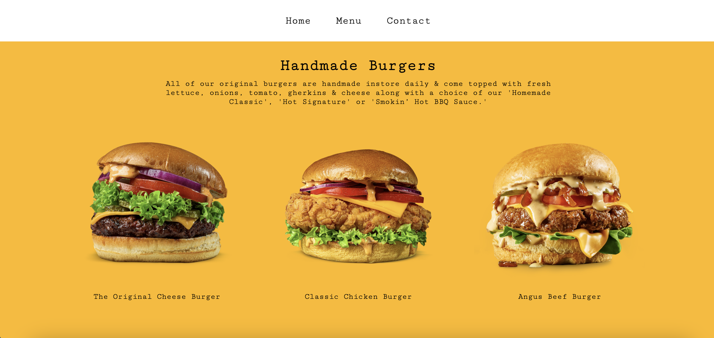

# Restaurant Page

## [Live Demo](https://erinsophie.github.io/restaurant-page/)

# Technologies Used 

- HTML
- CSS
- Javascript

# Project goals

- The main goal of this project was to continue practicing DOM manipulation by dynamically rendering a simple restaurant homepage, using JavaScript alone to generate the entire contents of the website.
- The other main goal was to learn how to use webpack and ES6 modules in a project.
- After this, I now see how valuable and convienient modules are! Keeping my functions separate felt a lot more organised. 
- I also refactored my index.js into separate functions to avoid the use of global variables.